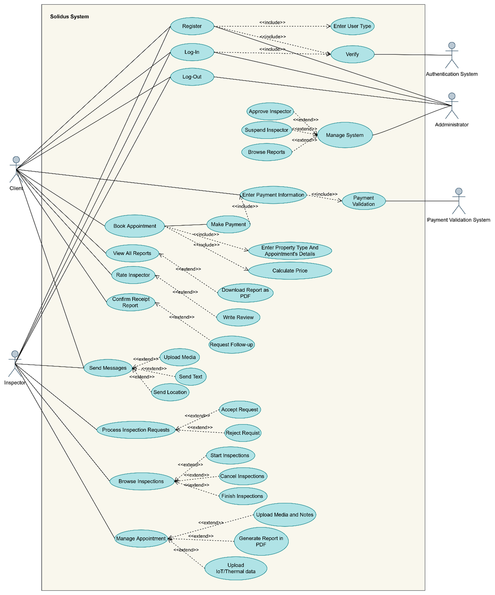
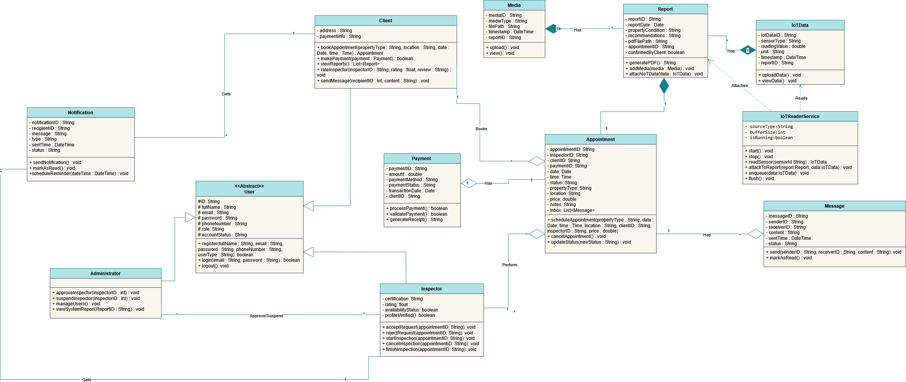

# Solidus: Building Inspection System
A structured software engineering project focused on the complete **SDLC** for a digital building inspection management platform.

## Technical Highlights
* **Requirement Engineering:** Defined functional and non-functional requirements for multiple user roles (Inspector, Admin).
* **Modeling:** Designed system architecture using **UML diagrams** and use-case modeling.
* **QA & Testing:** Developed a validation strategy to ensure system reliability and compliance with standards.

## Project Files
* **System Design:** [View Documentation (PDF)](./ٍSolidus-Report.pdf)

## System Modeling (UML Diagrams)

To ensure a robust architectural design, the following UML diagrams were developed:

### 1. Use Case Diagram
Describes the functional requirements and user interactions (Admin vs. Inspector).

### 2. Class Diagram
Illustrates the system's static structure and entity relationships.

### 3. Sequence Diagrams
Show how objects interact in a specific time sequence for key processes.
* **Process 1:** .png)
* **Process 2:** .png)

### 4. Activity Diagrams
Detail the workflow of building inspections and data validation.
* **Workflow A:** .png)
* **Workflow B:** .png)

### 5. State Diagrams
These diagrams define the various states of an inspection report and the system lifecycle, ensuring all transitions are handled correctly.

#### System State Lifecycle (Part 1)
.png)

#### Detailed Transition Logic (Part 2)
.png)

